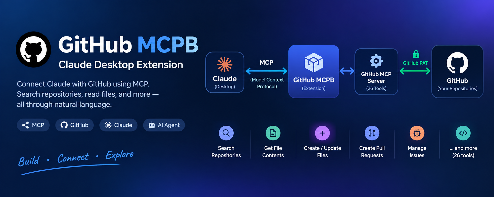
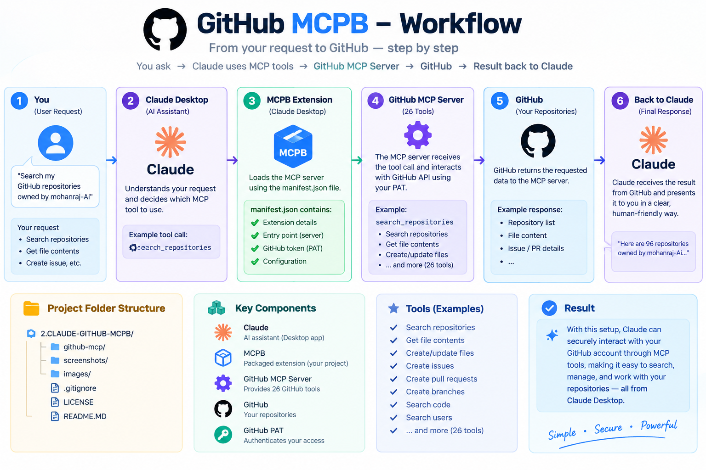
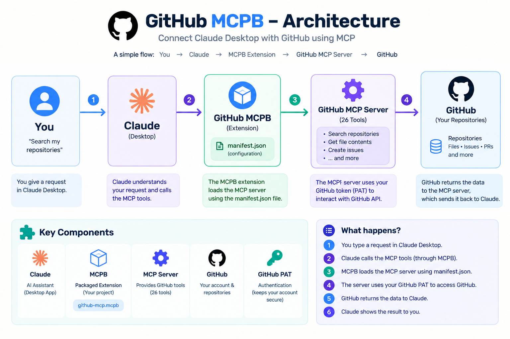
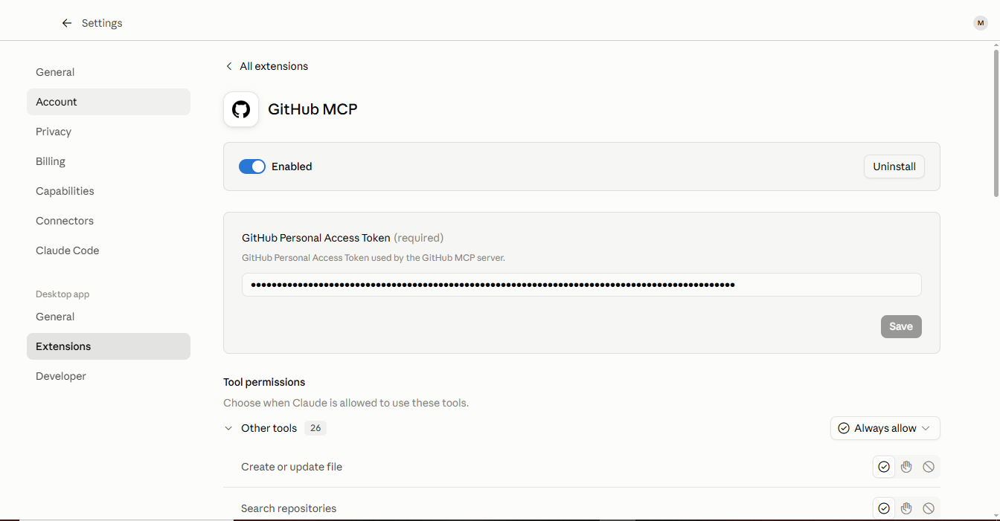
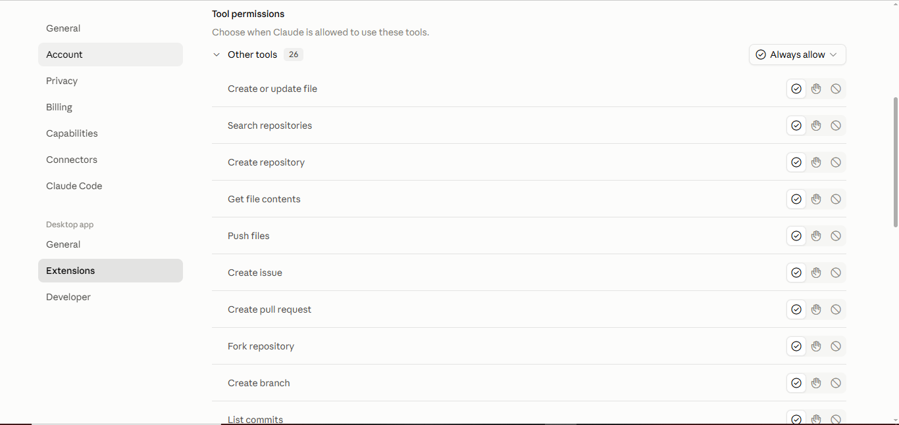
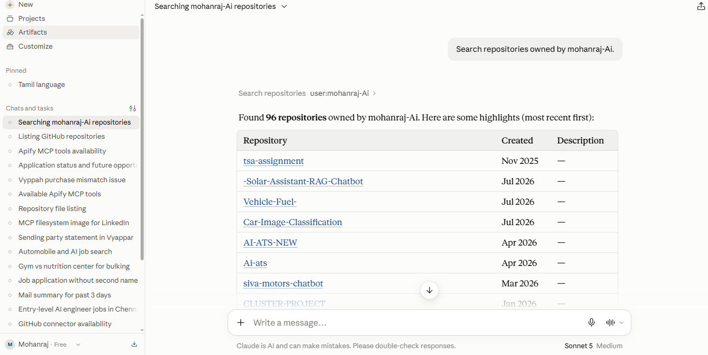
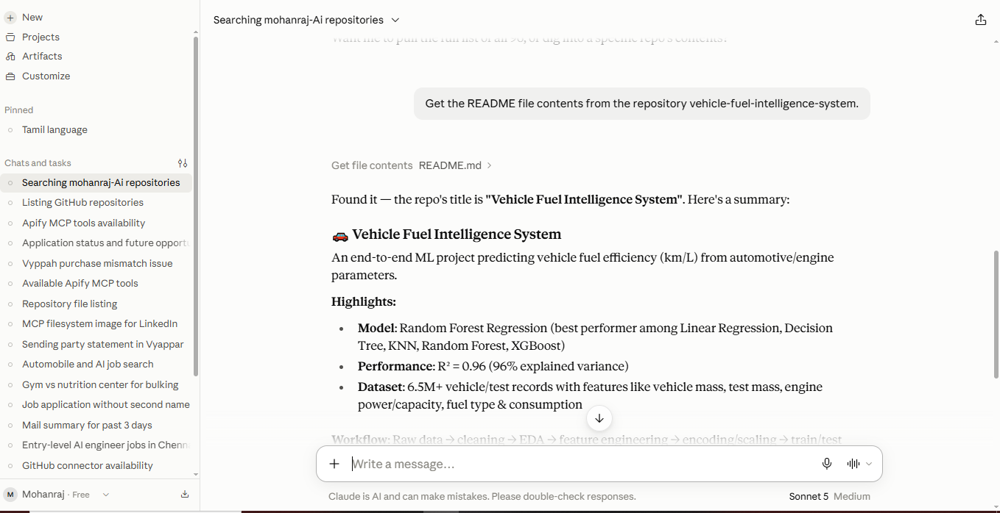

# 🚀 GitHub MCPB — AI-Powered GitHub Assistant

<p align="center">

**Claude Desktop + Model Context Protocol + GitHub**

Build an AI-powered GitHub assistant that allows Claude Desktop to interact with GitHub through MCP tools and an MCPB extension.

</p>

---

## 🖼️ Project Overview



This project demonstrates how **Model Context Protocol (MCP)** can connect an AI assistant such as **Claude Desktop** with GitHub.

Instead of manually performing GitHub operations, users can interact with GitHub using **natural-language commands**, while Claude selects and invokes the appropriate MCP tools.

### 🔗 Core Architecture

```text
Claude Desktop
      │
      ▼
MCPB Extension (.mcpb)
      │
      ▼
GitHub MCP Server
      │
      ▼
GitHub API
      │
      ▼
GitHub Repositories
```

---

# 🧠 What is MCP?

**Model Context Protocol (MCP)** is a standard protocol that allows AI applications to connect with external tools, data sources, and services.

In this project, MCP provides the communication layer between **Claude Desktop** and the **GitHub MCP server**.

This allows Claude to perform GitHub-related operations through structured tools rather than relying only on its built-in knowledge.

---

# 📦 What is MCPB?

**MCPB (MCP Bundle)** is a packaging format used to distribute MCP servers as installable extensions.

The project demonstrates the following flow:

```text
MCP Server
     │
     ▼
MCP Configuration
     │
     ▼
MCPB Package
     │
     ▼
Claude Desktop
```

This makes the MCP server easier to install and configure within a compatible MCP client.

---

# 🔄 Project Workflow



### Step-by-step flow

```text
1. User sends a request to Claude
                ↓
2. Claude understands the request
                ↓
3. Claude selects the required GitHub MCP tool
                ↓
4. GitHub MCP server receives the tool request
                ↓
5. MCP server communicates with GitHub
                ↓
6. GitHub returns the requested information
                ↓
7. Claude presents the result to the user
```

---

# 🏗️ Architecture



The project consists of the following major components:

| Component                | Role                                                              |
| ------------------------ | ----------------------------------------------------------------- |
| 🤖 **Claude Desktop**    | AI interface used to interact with GitHub                         |
| 📦 **MCPB Extension**    | Packages and configures the MCP server                            |
| 🔌 **GitHub MCP Server** | Provides GitHub-specific MCP tools                                |
| 🐙 **GitHub**            | Provides repositories, files, commits, issues and other resources |

---

# ⚡ Key Features

### 🤖 Natural-Language GitHub Interaction

Interact with GitHub using normal language instead of manually navigating through multiple GitHub pages.

### 🔌 MCP Integration

Uses the **Model Context Protocol** to expose GitHub functionality to an AI assistant.

### 📦 MCPB Packaging

Packages the MCP server as an **`.mcpb` extension** for easier integration with Claude Desktop.

### 🐙 GitHub Tools

Provides access to GitHub functionality through dedicated MCP tools.

### 🔎 Repository Search

Search GitHub repositories using natural-language requests.

### 📄 File Access

Retrieve repository file contents through GitHub MCP tools.

### 🛠️ Tool Calling

Claude can determine which available GitHub MCP tool is appropriate for a user's request.

---

# 📸 Screenshots

## 1️⃣ MCPB Extension Installed



This screenshot demonstrates the **MCPB extension installed and configured** for use with Claude Desktop.

---

## 2️⃣ GitHub MCP Tools



This demonstrates the GitHub MCP tools available to Claude.

The tools allow Claude to interact with GitHub through the MCP server.

---

## 3️⃣ GitHub Repository Search



Example of using Claude to perform a **GitHub repository search** through an MCP tool.

---

## 4️⃣ GitHub File Contents



Example of retrieving **file contents from a GitHub repository** using the GitHub MCP integration.

---

## 5️⃣ Additional Test


Additional testing and validation of the GitHub MCP integration.

---

# 💬 Example Commands

Once the GitHub MCP integration is configured, users can interact with GitHub using requests such as:

### 🔎 Search repositories

```text
Search my GitHub repositories for Generative AI projects.
```

### 📂 Explore repository files

```text
Show me the files in my vehicle-fuel-intelligence-system repository.
```

### 📄 Read a file

```text
Show me the README.md file from my repository.
```

### 🔀 Pull requests

```text
Show me the open pull requests in this repository.
```

### 📝 Issues

```text
Show me the issues in my repository.
```

> The exact operations available depend on the GitHub MCP server configuration and the tools exposed to Claude.

---

# 🛠️ Technologies Used

* 🤖 **Claude Desktop**
* 🔌 **Model Context Protocol (MCP)**
* 📦 **MCPB**
* 🐙 **GitHub**
* 🟢 **Node.js**
* 📦 **npm / npx**
* 🔐 **GitHub Authentication**
* 💻 **VS Code**
* 🪟 **Windows**

---

# 📁 Project Structure

```text
2.CLAUDE-GITHUB-MCPB/
│
├── 📁 images/
│   ├── architecture.png
│   ├── banner.png
│   └── workflow.png
│
├── 📁 screenshots/
│   ├── 01-mcpb-extension-installed.PNG
│   ├── 02-github-mcp-tools.PNG
│   ├── 03-github-mcp-repository-search.PNG
│   ├── 04-github-mcp-file-contents.PNG
│   └── Capture.PNG
│
├── 📄 manifest.json
├── 📄 README.md
├── 📄 LICENSE
└── 📄 .gitignore
```

> Additional source or configuration files may be present depending on the MCPB implementation.

---

# ⚙️ Setup

## 1. Install Node.js

Verify Node.js:

```bash
node --version
```

Verify npm:

```bash
npm --version
```

---

## 2. Configure GitHub Authentication

A GitHub authentication token may be required depending on the GitHub MCP server configuration.

Store credentials securely using environment variables or the authentication mechanism supported by the MCP server.

### ⚠️ Security

**Never commit authentication tokens or API keys to GitHub.**

Do not store secrets directly inside:

```text
README.md
manifest.json
source code
GitHub repository
```

Use environment variables or another secure credential mechanism.

---

## 3. Configure the MCPB Extension

The MCPB configuration defines how Claude Desktop launches and communicates with the GitHub MCP server.

The general concept is:

```text
Claude Desktop
       │
       ▼
MCPB Configuration
       │
       ▼
GitHub MCP Server
       │
       ▼
GitHub
```

---

# 🧩 Understanding Tool Calling

One of the important concepts demonstrated in this project is **AI tool calling**.

For example, the user asks:

```text
"Find my GitHub repositories related to machine learning."
```

The process is:

```text
User Request
     │
     ▼
Claude
     │
     ▼
Understand Intent
     │
     ▼
Select GitHub MCP Tool
     │
     ▼
GitHub MCP Server
     │
     ▼
GitHub
     │
     ▼
Search Result
     │
     ▼
Claude
     │
     ▼
Natural-Language Response
```

This demonstrates how an LLM can interact with an external service through structured tools.

---

# 🆚 Traditional GitHub Workflow vs MCP Workflow

### Traditional workflow

```text
User
 ↓
Open GitHub
 ↓
Find repository
 ↓
Navigate files / issues / PRs
 ↓
Perform operation
 ↓
Read result
```

### MCP-powered workflow

```text
User
 ↓
Claude
 ↓
MCP Tool
 ↓
GitHub MCP Server
 ↓
GitHub
 ↓
Result
 ↓
Claude
```

MCP provides a standardized way for AI applications to interact with external capabilities.

---

# 🎯 Use Cases

This type of integration can be useful for:

* 🔎 Repository discovery
* 📂 Repository exploration
* 📄 File retrieval
* 📝 Issue management
* 🔀 Pull-request workflows
* 📊 Repository information
* 🤖 AI-assisted developer workflows
* 🧩 Building larger agentic systems with multiple MCP servers

---

# 💡 Key Learning Outcomes

Through this project, I gained practical experience with:

* Model Context Protocol architecture
* MCP servers
* MCP tools
* MCPB packaging
* Claude Desktop integration
* GitHub integration
* AI tool calling
* Natural-language tool invocation
* MCP configuration
* Authentication and environment configuration
* Debugging MCP integrations
* GitHub repository operations through AI

---

# 🚀 Future Improvements

Potential future extensions include:

* 🤖 AI-powered GitHub issue creation
* 📝 Automatic issue summarization
* 🔀 Pull-request analysis
* 🧠 AI-assisted code review
* 📊 Repository analytics
* 📈 GitHub activity summaries
* 🔗 Multiple MCP server integration
* 🤝 Multi-agent + MCP architecture
* ☁️ Cloud-based MCP deployment

---

# 👨‍💻 About Me

## Mohanraj P

**AI/ML Engineer | Generative AI Engineer | LLM, RAG & AI Agents**

I am an Automobile Engineering graduate transitioning into **AI/ML and Generative AI**, with hands-on experience building AI applications and automation projects using Python, Machine Learning, LLMs, RAG, AI Agents, LangChain, LangGraph and MCP.

I am particularly interested in building practical AI systems that combine **LLMs, external tools, domain knowledge and automation**.

### 🔗 Connect

* 💼 LinkedIn: [Mohanraj P](https://linkedin.com/in/mohan-raj-p-2bb994217)
* 🐙 GitHub: [mohanraj-Ai](https://github.com/mohanraj-Ai)

---

# ⭐ Project Highlights

```text
🤖 Claude Desktop
        +
🔌 Model Context Protocol
        +
📦 MCPB
        +
🐙 GitHub
        =
🚀 AI-Powered GitHub Assistant
```

---

# 📜 License

This project is licensed under the **MIT License**.
